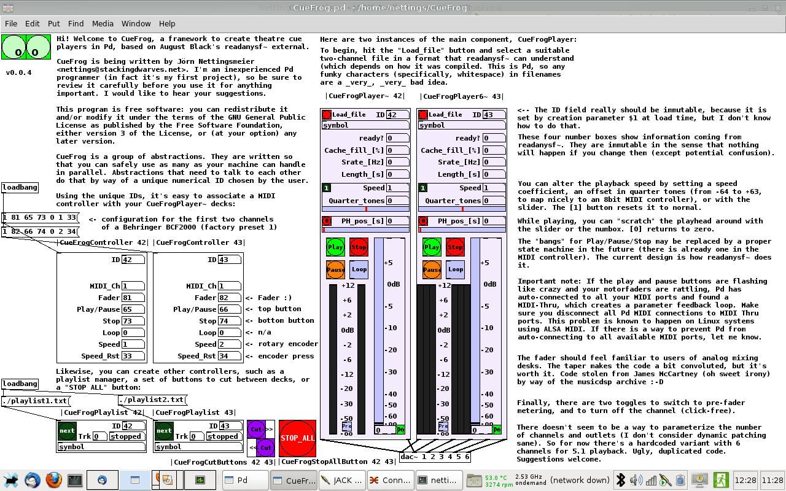

CueFrog
=======

CueFrog is a simple, idiosyncratic theatre cue player toolkit written in Pd.
CueFrog is a theatre cue player framework for Pd, based on August Black's
readanysf~ external (which it requires). You can get readanysf~ from
http://aug.ment.org/readanysf/

Basic documentation to get you started is in the CueFrog.pd abstraction.

Copyright 2012 Jörn Nettingsmeier <nettings@stackingdwarves.net>.

This program is free software: you can redistribute it and/or modify
it under the terms of the GNU General Public License as published by
the Free Software Foundation, either version 3 of the License, or
(at your option) any later version.

This program is distributed in the hope that it will be useful,
but WITHOUT ANY WARRANTY; without even the implied warranty of
MERCHANTABILITY or FITNESS FOR A PARTICULAR PURPOSE.  See the
GNU General Public License for more details.

You should have received a copy of the GNU General Public License
along with this program.  If not, see <http://www.gnu.org/licenses/>.

